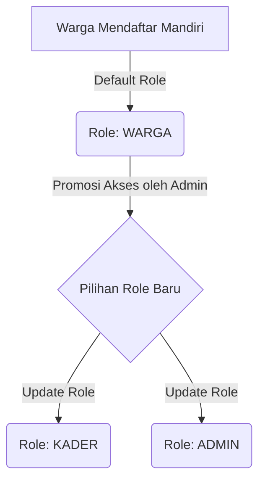

# Blueprint: SiPinter (Sistem Informasi & Pemantauan Posyandu Terintegrasi)

Dokumen ini merupakan cetak biru (blueprint) menyeluruh yang menggabungkan Skenario Manajemen User (Fitur Leveling) dengan 5 Modul Utama Aplikasi Posyandu. Sistem ini dirancang terintegrasi agar setiap modul memiliki batasan hak akses yang jelas antara **Warga**, **Kader**, dan **Admin**.

---

## 1. Arsitektur Leveling User & Matriks Akses Modul

Secara default, seluruh pendaftar baru akan masuk ke dalam sistem dengan level akses sebagai **Warga**. Admin atau Super Admin memiliki wewenang untuk menaikkan hak akses warga menjadi **Kader** atau **Admin** melalui Modul Manajemen User.

### Alur Promosi Hak Akses

### Matriks Akses Modul

| Modul Aplikasi | Warga | Kader | Admin |
| :--- | :--- | :--- | :--- |
| **0. Manajemen User & Keamanan** | Hanya Profil Sendiri | Hanya Profil Sendiri | Full Control (Ubah Role) |
| **1. Pendataan Master Data** | Read (Keluarga Sendiri) | Create, Read, Update | Full Control |
| **2. Pencatatan & Pemantauan** | Read (KMS Anak Sendiri) | Create, Read, Update | Full Control |
| **3. Penjadwalan & Notifikasi** | Read & Terima WA | Create, Read, Update | Full Control |
| **4. Pelaporan & Analitik** | Read (Statistik Publik) | Read & Export Laporan | Full Control |

---

## 2. Rincian Modul Terintegrasi Sesuai Hak Akses

### Modul 0: Manajemen User & Hak Akses (Core System)
*   **Warga:**
    *   Registrasi mandiri (NIK, Nama, No. WhatsApp, Password) &rarr; *Default Role: Warga*.
    *   Kelola profil pribadi dan ubah password.
*   **Kader:**
    *   Melihat daftar warga di wilayah binaan (tingkat RT/RW).
*   **Admin:**
    *   **User Management Panel:** Mencari user, mengaktifkan/nonaktifkan akun.
    *   **Role Assignment:** Mengubah role Warga &rarr; Kader / Admin / Bidan Desa.
    *   **Audit Log:** Memantau riwayat perubahan data dan aktivitas penting sistem.

### Modul 1: Pendataan Master Data (Siklus Hidup)
*   **Warga:**
    *   Melihat anggota keluarga yang terdaftar dalam Kartu Keluarga (KK)-nya.
    *   Mengajukan pembaruan data keluarga jika terdapat kesalahan.
*   **Kader & Admin:**
    *   Input/Edit data KK, Ibu Hamil, Bayi/Balita (0–5 tahun), Remaja, dan Lansia.
    *   Pemetaan sasaran berdasarkan domisili RT/RW.

### Modul 2: Pencatatan & Pemantauan Rutin (Hari Buka Posyandu)
*   **Warga:**
    *   **KMS Digital:** Tampilan grafik pertumbuhan anak (Standar WHO: BB/U, TB/U, LK) secara interaktif dari HP warga.
    *   Melihat riwayat imunisasi, pemberian Vitamin A, obat cacing, dan catatan kesehatan lainnya.
*   **Kader & Admin:**
    *   Form entri cepat saat Hari Buka Posyandu (Pengukuran Berat Badan (BB), Tinggi Badan (TB), Lingkar Kepala (LK), Lingkar Lengan Atas (LILA)).
    *   **Kalkulasi Otomatis Gizi & Stunting:** Sistem otomatis menghitung Z-Score dan memberi indikator warna (Hijau/Kuning/Merah).
    *   Pencatatan pemberian imunisasi & vitamin.

### Modul 3: Penjadwalan, Notifikasi, & Sweeping
*   **Warga:**
    *   Melihat kalender jadwal Posyandu mendatang.
    *   Menerima notifikasi otomatis (WhatsApp/Push Notification) sebagai pengingat jadwal penimbangan & imunisasi anak.
*   **Kader & Admin:**
    *   Membuat & mengelola jadwal kegiatan Posyandu.
    *   *Trigger* pengiriman pesan pengingat otomatis via WhatsApp Gateway.
    *   **Modul Kunjungan Rumah (Sweeping):** Mencatat warga/balita yang tidak hadir untuk ditindaklanjuti dengan kunjungan rumah.

### Modul 4: Pelaporan & Dashboard Analitik
*   **Warga:**
    *   Melihat ringkasan informasi/edukasi kesehatan umum di halaman utama (Dashboard Publik).
*   **Kader & Admin:**
    *   **Dashboard Posyandu:** Ringkasan jumlah kehadiran (D/S), tren kenaikan berat badan (N/D), serta angka risiko stunting di wilayah RW.
    *   **Ekspor Laporan:** Mengunduh Laporan Standar SIP (Sistem Informasi Posyandu) Format F1–F6 ke format Excel/PDF untuk diserahkan ke pihak Puskesmas/Desa.

---

## 3. Alur Penggunaan Aplikasi (User Journey)

Berikut adalah simulasi perjalanan pengguna (User Journey) dalam ekosistem SiPinter:

1.  **Tahap Mendaftar (Registrasi Awal):**
    *   Ibu Maria (Warga Baru) mengunduh/membuka aplikasi.
    *   Mendaftar menggunakan NIK.
    *   Akun otomatis aktif dengan peran sebagai **Warga**.
2.  **Penggunaan oleh Warga:**
    *   Ibu Maria login dan dapat langsung melihat jadwal Posyandu bulan ini.
    *   Ibu Maria dapat mengecek KMS digital anaknya secara mandiri.
3.  **Penunjukan Kader (Promosi Hak Akses):**
    *   Pengurus Posyandu menunjuk Ibu Maria menjadi Kader baru.
    *   **Admin** membuka menu *User Management*.
    *   Admin mencari NIK Ibu Maria dan **mengubah role-nya menjadi Kader**.
4.  **Penggunaan oleh Kader:**
    *   Saat Ibu Maria login kembali ke aplikasi, menu di HP-nya otomatis bertambah sesuai hak akses barunya.
    *   Kini muncul tombol *Input Penimbangan*, *Kirim Notifikasi WA*, dan *Export Laporan* yang siap digunakan untuk bertugas.

---

## 4. Panduan Antarmuka (UI/UX) & Bahasa

- **Bahasa Utama:** Bahasa Indonesia. Seluruh teks antarmuka aplikasi, pesan sistem, notifikasi, laporan, dan panduan harus menggunakan Bahasa Indonesia yang baku namun mudah dipahami oleh Warga dan Kader.
- **Konsep Visual:** Desain bergaya modern dan premium.
  - Menggunakan palet warna yang identik dengan kesehatan (seperti perpaduan hijau lembut dan biru).
  - Memanfaatkan elemen *glassmorphism* halus dan tipografi modern (seperti Inter atau Roboto) alih-alih bawaan *browser*.
- **Tata Letak (Layout):**
  - **Sidebar/Bottom Navigation:** Untuk menu utama terintegrasi, disesuaikan agar sangat *mobile-friendly* (karena Warga dan Kader umumnya mengakses lewat HP).
  - **Header:** Untuk profil pengguna aktif.
  - **Konten Utama:** Menampilkan kartu statistik dengan *micro-animations* saat diinteraksikan, grafik visual KMS yang menarik, dan tabel data yang bersih tanpa garis yang berlebihan.
- **Fokus Interaksi:** Desain harus terasa responsif dan "hidup", menghindari tampilan tabel atau *form* kaku ala sistem konvensional, sehingga memberi pengalaman *wow* kepada penggunanya.

---

## 5. Konfigurasi Sistem Khusus

- **Zona Waktu Server:** Diatur secara spesifik menggunakan `Asia/Jakarta` (GMT+7) untuk menyesuaikan dengan waktu lokal (khususnya wilayah Bekasi).
- **Jenis Database:** Memanfaatkan **MySQL** sebagai penggerak *database* utama untuk reliabilitas pendataan relasional.
- **Skala Penjadwalan:** Proses pemetaan kader, balita, dan penjadwalan jadwal rutin Posyandu dikelompokkan dan dikelola pada tingkat area **Sekelurahan**.
