# UML Documentation - Aplikasi SiPintar (Sistem Informasi Posyandu Pintar)

Dokumen ini berisi representasi diagram UML *(Unified Modeling Language)* yang lengkap untuk memvisualisasikan struktur basis data, interaksi aktor, kelas model, serta alur sistem aplikasi SiPintar.

---

## 1. Entity Relationship Diagram (ERD)

Diagram berikut mendeskripsikan relasi antar entitas utama yang ada pada sistem basis data.

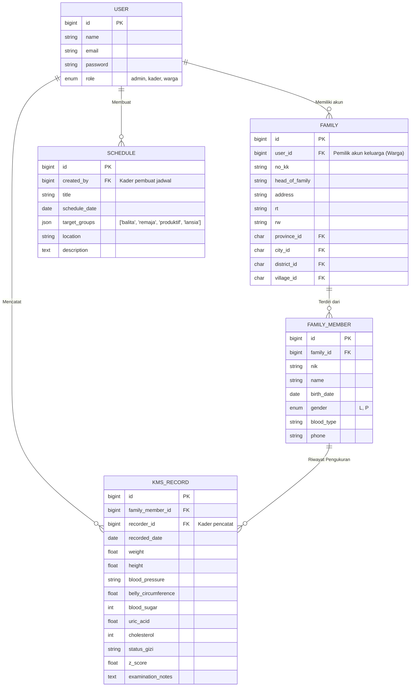

---

## 2. Class Diagram

Memetakan kelas-kelas utama (berbasis Model di Laravel) beserta atribut dan perilakunya.

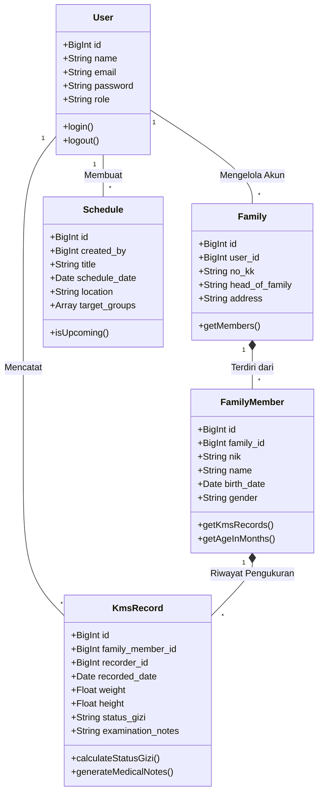

---

## 3. Use Case Diagram

Menggunakan pendekatan Flowchart LR untuk merender interaksi Aktor dengan 7 Use Case utama secara rapi.

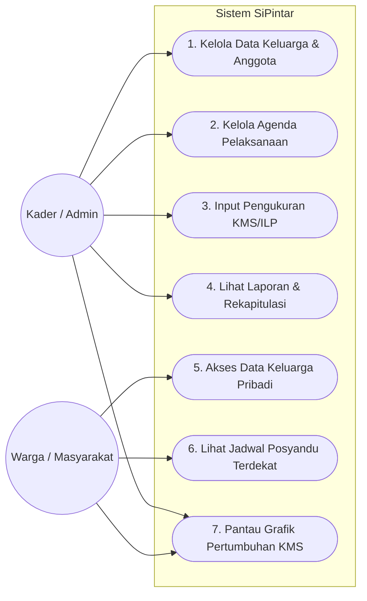

---

## 4. Activity Diagram (7 Aksi Use Case)

### UC1. Kelola Data Keluarga & Anggota
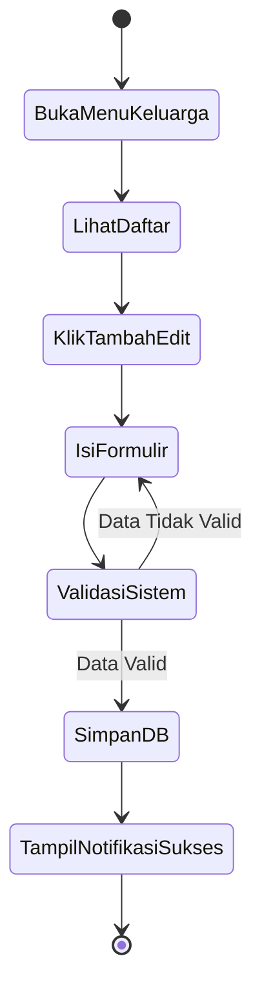

### UC2. Kelola Agenda Pelaksanaan
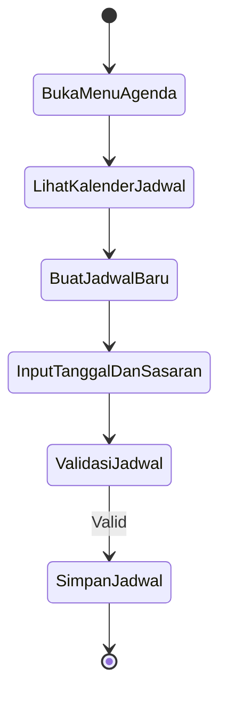

### UC3. Input Pengukuran KMS/ILP
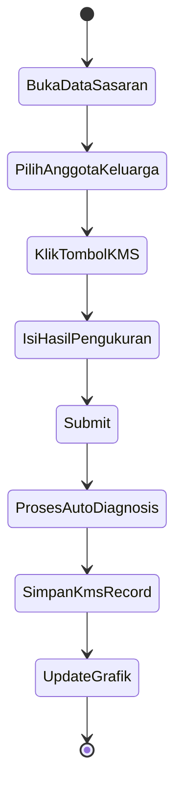

### UC4. Lihat Laporan & Rekapitulasi
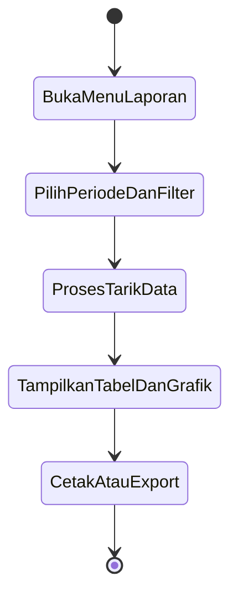

### UC5. Akses Data Keluarga Pribadi
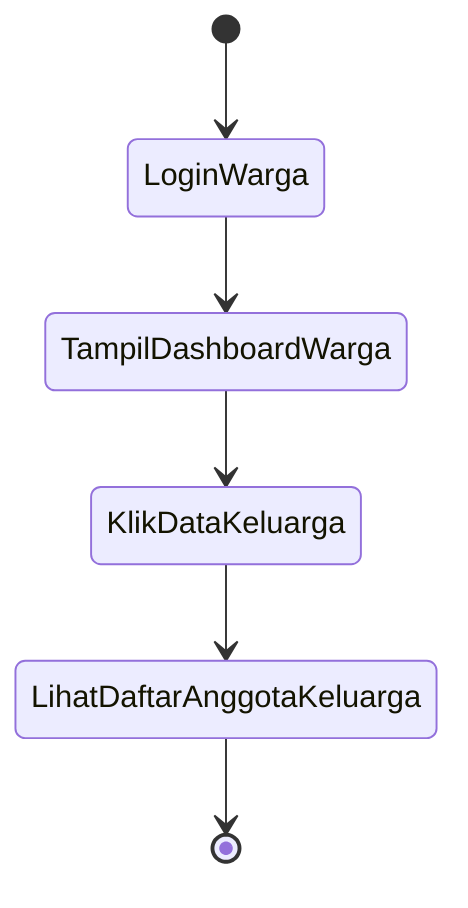

### UC6. Lihat Jadwal Posyandu Terdekat
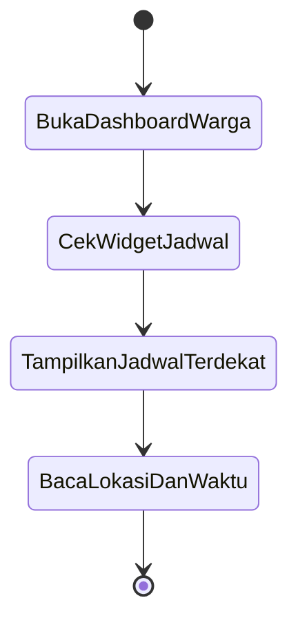

### UC7. Pantau Grafik Pertumbuhan KMS
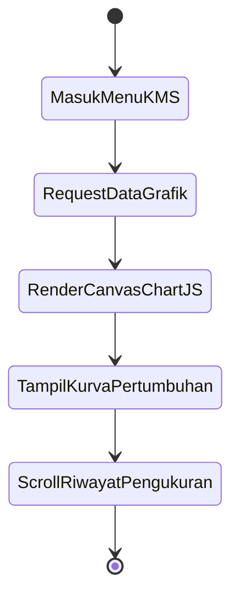

---

## 5. Sequence Diagram (7 Aksi Use Case)

### UC1. Kelola Data Keluarga & Anggota
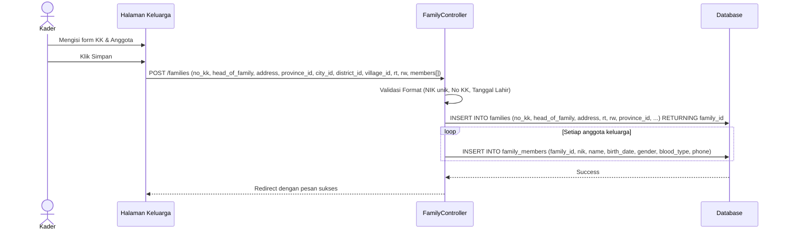

### UC2. Kelola Agenda Pelaksanaan
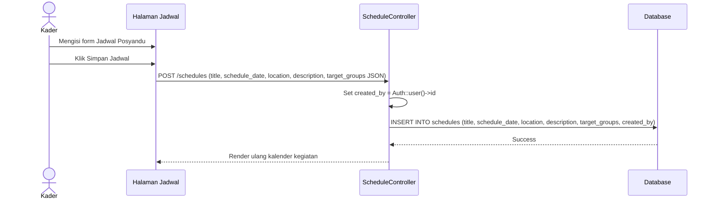

### UC3. Input Pengukuran KMS/ILP
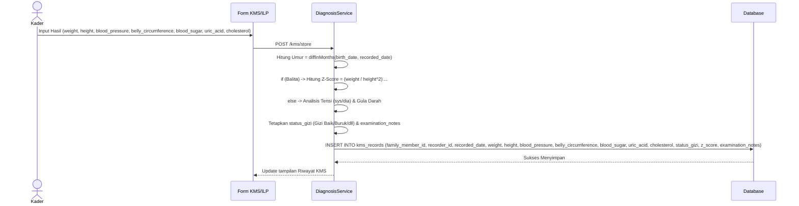

### UC4. Lihat Laporan & Rekapitulasi
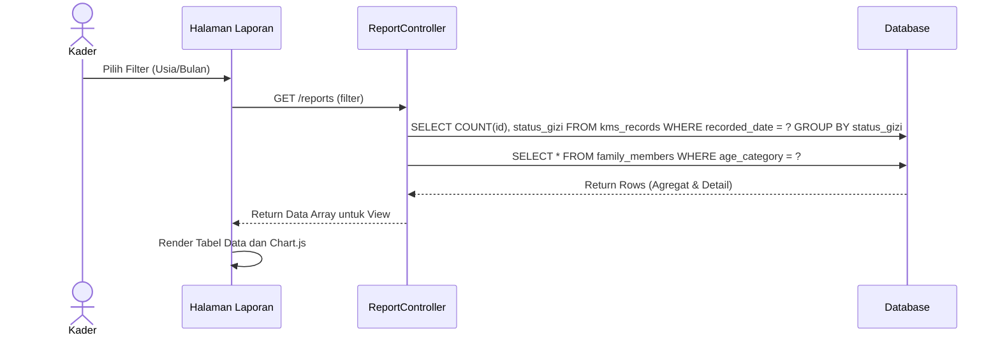

### UC5. Akses Data Keluarga Pribadi
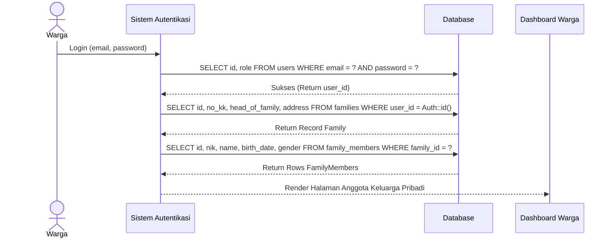

### UC6. Lihat Jadwal Posyandu Terdekat
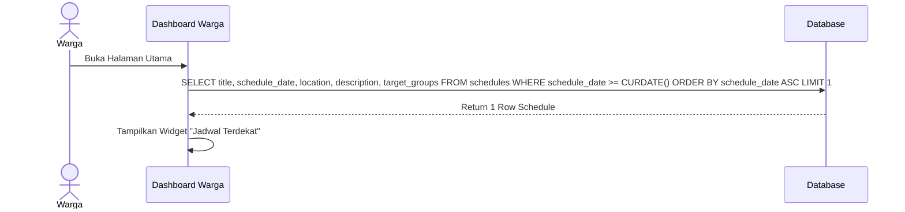

### UC7. Pantau Grafik Pertumbuhan KMS
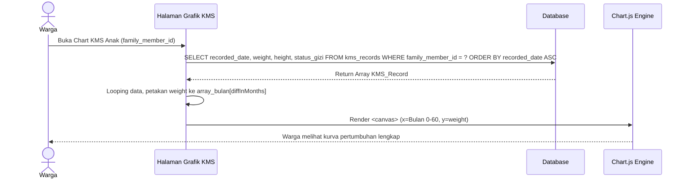
